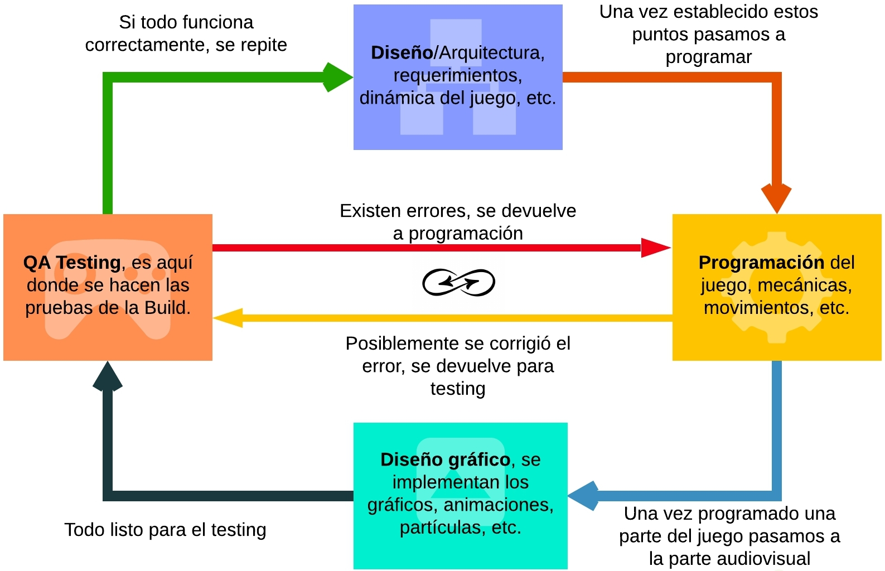

# ¿Cómo funciona el testing de Black Box en un estudio de videojuegos?

## White Box

Está relacionado con el testeo del código fuente, revisaremos si el código se entiende, es funcional o si se puede mejorar de alguna manera.

## Black Box

Nosotros testearemos como si fueramos los jugadores, es decir, los usuarios.

## Diagrama

